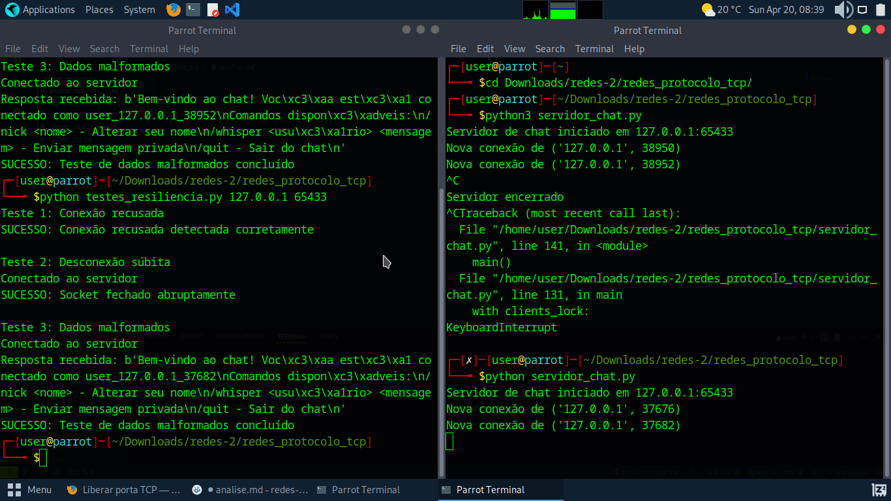

Descrição do wireshark:

SYN: Usado para estabelecer o primeiro contanto entre o cliente e o servidor.

SYN-ACK: Resposta do servidor para o primeiro contato do cliente em caso positivo, assim permitindo a conexão.

ACK: Confirmação de recebimento de pacote, durante a conexão as confirmações são enviadas tanto pelo servidor quanto pelo cliente durante o envio e o recebimento de menssagem.

FIN-ACK: Confirmação de encerramento correto da conexão, é enviado tanto pelo servidor quanto pelo cliente.

Comentarios extras: Menssagens estão sendo transmitidas em texto claro.

Problemas indetificados nos códigos servidor_tcp e cliente_tcp:

1-Não identifica usuários ociosos.

2-Falta de criptografia.

3-try/exept genéricos não trata erros especificos.

Problemas indetificados nos códigos servidor_chat e cliente_chat presentes em problemas.md;

Teste de resiliencia:

Teste 1: O cliente conseguiu identificar corretamente a falha de conexão e tratá-la, encerrando o teste com sucesso.

Teste 2: O cliente detectou o fechamento inesperado da conexão e lidou com isso corretamente.

Teste 3: O servidor não travou nem encerrou a conexão, mesmo ao lidar com dados malformados. Isso demonstra robustez contra esse tipo de entrada.
