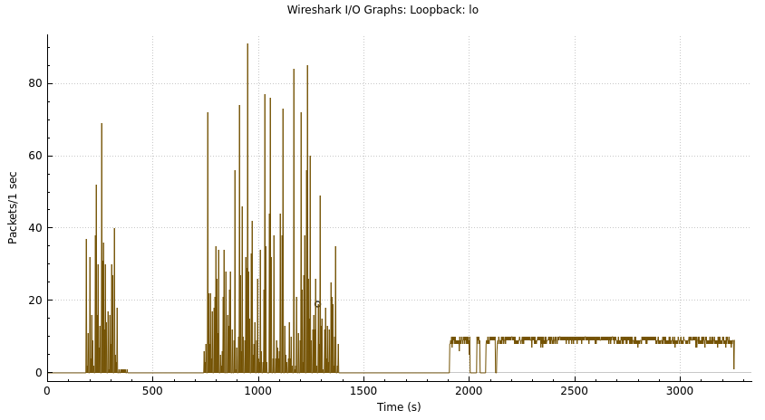

Atividade 1:

Wireshark:

Analisando os pacotes vemos que os dados não estão criptografados. De cabeçalhos importantes eu encontrei O "Time to live"(tempo de vida do pacote na rede caso não chegue no usuário), os ip de destino e final e o tipo de protocolo do pacote.

Atividade 2:

Comparação TCP vs UDP:

Cenário 1:

Resumo da transferência UDP:
Tempo (s)       | Taxa (KB/s)     | Retransmissões 
2.16            | 2373.67         | 0             
tamanho de cabeçalho:

Resumo da tranferência TCP:
Tamanho enviado: 5120.00 KB
Tempo total: 0.07 segundos
Taxa de transferência: 78031.86 KB/s
Retransmições: 3

OBS.: Os testes foram feitos no mesmo computador já que não possuo dois computadores em casa.

Cenário 2(5% de perda de pacote):

Resumo da transferência UDP:
Tempo (s)       | Taxa (KB/s)     | Retransmissões 
633.95          | 8.08            | 126 

Resumo da tranferência TCP:
Tamanho enviado: 5120.00 KB
Tempo total: 0.10 segundos
Taxa de transferência: 52023.76 KB/s
Retransmissõe: 3 (contagem usando tcp.analysis.retransmission no wireshark)

Cenario 3:

Resumo UDP:
Tempo (s)       | Taxa (KB/s)     | Retransmissões 
1124.57         | 4.55            | 0             

Resumo TCP:
Tamanho enviado: 5120.00 KB
Tempo total: 1.35 segundos
Taxa de transferência: 3778.61 KB/s
Retransmissões: 0

Tabela de conclusão:
| Protocolo | Cenário | Tempo (s)   | Taxa (KB/s) | Retransmissões | Overhead (%) |
| UDP       | C1      | 2.16 segs   | 2373.67     | 0              | 1.11%        |
| TCP       | C1      | 0.03 segs   | 78031.86    | 3              | 1.59%        |
| UDP       | C2      | 633.5 segs  | 8.08        | 126            | 1.11%        |
| TCP       | C2      | 0.01 segs   | 52023.76    | 3              | 1.59%        |
| UDP       | C3      | 1124.57 segs| 4.55        | 0              | 1.11%        |
| TCP       | C3      | 1.35 segs   | 3778.61     | 0              | 1.59%        |

Grafico UDP do wireshark(contém os três cenários):

O protocolo UDP acabou não se saindo melhor em nenhum cenário, o que é estranho, visto que no primeiro cenário ele deveria ser melhor que o tcp. Nos cenarios onde existe perda e delay o udp se saiou muito pior que o tcp, imagino que pelo cenário 1 já ter sido ruim para o udp os outros iriam piorar, porém não imaginava que iria ser muito. O udp é recomendado para situações onde a velocidade de entrega deve ser maior do que a confirmação de entrega, caso contrario o tcp será melhor.

Reflexões finais:

Quais foram os principais desafios ao implementar aplicações com UDP?

R:A princiapal problema enfrentado foi em relação ao desempenho na hora de implementar o servidor de arquivos, visto que o udp estava se saindo muito pior que o tcp, depois de algumas alterações como o aumento de buffer e no tamanho do pacote

Como você contornou a falta de garantias de entrega do UDP?

R:Foi implementado um comando de recebimento de pacotes no servidor, então toda vez que o servidor recebe um pocote ele envia a confirmação, o cliente fica reenviando os pacotes de 1 em 1 segundo até que o servidor confirme o recebimento.

Em quais situações você recomendaria o uso de UDP ao invés de TCP?

R:Em sistemas onde a entrega rápida é prioridade em relação a confiabilidade da entraga, por exemplo em jogos online de muita ação, em video chamadas, chamadas de audio e streming ao vivo.

Como o comportamento do UDP poderia impactar aplicações de tempo real?

R: Ele pode diminuir a latencia do recebimento de pacotes, além de possuir um cabeçalho menor o que permite pacotes com a mesma quantidade de dados serem menores com o protocolo udp em comparação a tcp. Os pontos negativos que o UDP pode apresentar são dados problemas de audio e video em transmissões ao vivo ou em chamadas via aplicativos de ligação, pode ocasionar em lag em jogos online. Todos esses problemas são causados pela não garantia de entrega, ocasionando em possiveis perdas de pacote.