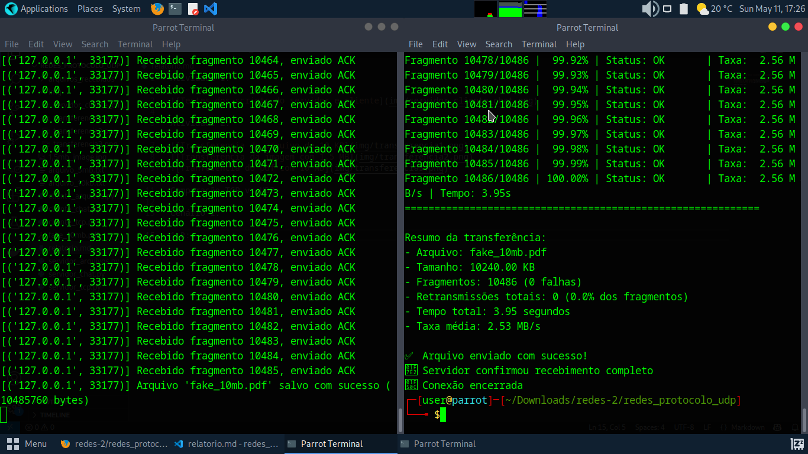

Atividade 1:

Wireshark:

Analisando os pacotes vemos que os dados não estão criptografados. De cabeçalhos importantes eu encontrei O "Time to live"(tempo de vida do pacote na rede caso não chegue no usuário), os ip de destino e final e o tipo de protocolo do pacote.

Atividade 2:

Comparação TCP vs UDP:

Cenário 1:

Resumo da transferência UDP:
Tempo (s)       | Taxa (KB/s)     | Retransmissões 
2.16            | 2373.67         | 0             
tamanho de cabeçalho:

Resumo da tranferência TCP:
Tamanho enviado: 5120.00 KB
Tempo total: 0.07 segundos
Taxa de transferência: 78031.86 KB/s
Retransmições: 3

OBS.: Os testes foram feitos no mesmo computador já que não possuo dois computadores em casa.

Cenário 2(5% de perda de pacote):

Resumo da transferência UDP:
Tempo (s)       | Taxa (KB/s)     | Retransmissões 
633.95          | 8.08            | 126 

Resumo da tranferência TCP:
Tamanho enviado: 5120.00 KB
Tempo total: 0.10 segundos
Taxa de transferência: 52023.76 KB/s
Retransmissõe: 3 (contagem usando tcp.analysis.retransmission no wireshark)

Cenario 3:

Resumo UDP:

Resumo TCP:
Tamanho enviado: 5120.00 KB
Tempo total: 1.35 segundos
Taxa de transferência: 3778.61 KB/s
Retransmissões: 0

Tabela de conclusão:
| Protocolo | Cenário | Tempo (s) | Taxa (KB/s) | Retransmissões | Overhead (%) |
| UDP       | C1      | 2.16 segs | 2373.67     | 0              | Overhead (%) |
| TCP       | C1      | 0.03 segs | 78031.86    | 3              | Overhead (%) |
| UDP       | C2      | 633.5 segs| 8.08        | 126            | Overhead (%) |
| TCP       | C2      | 0.01 segs | 52023.76    | 3              | Overhead (%) |
| UDP       | C3      | 0.01 segs | 52023.76    | 3              | Overhead (%) |
| TCP       | C3      | 1.35 segs | 3778.61     | 0              | Overhead (%) |
